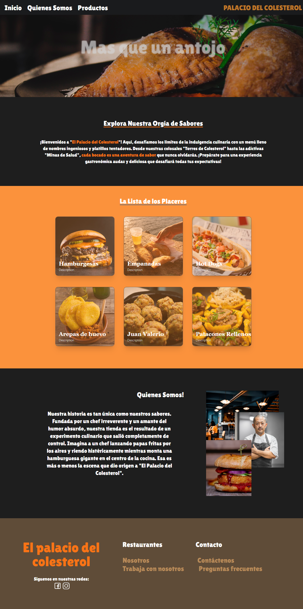
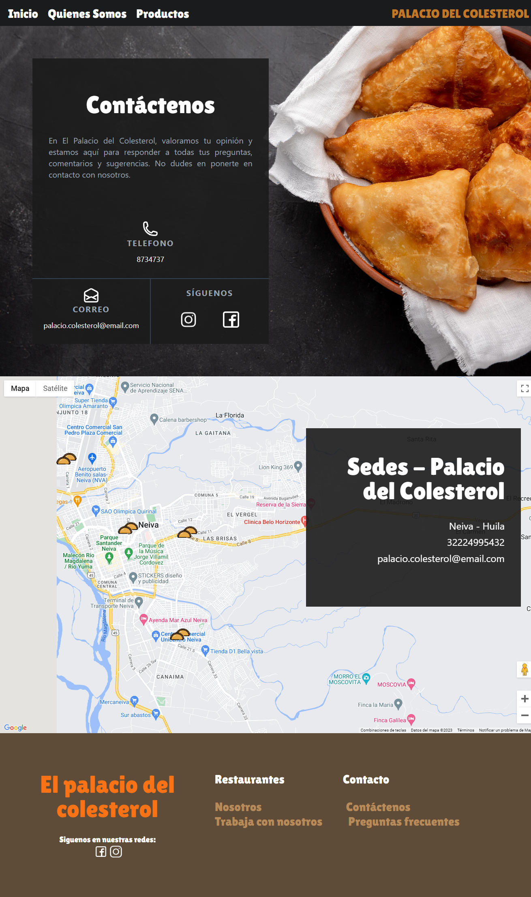
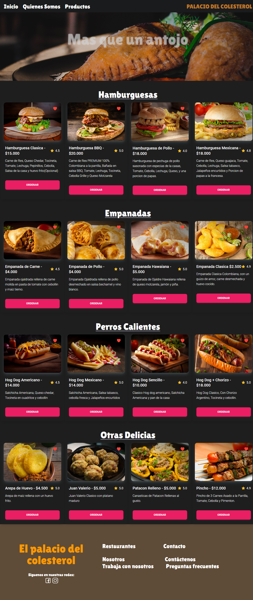

# Palacio del Colesterol

Este proyecto es una aplicación web llamada "Palacio del Colesterol" que utiliza React, Tailwind CSS y Vite para mostrar información relacionada de una tienda de comida deliciosa pero poco saludables.

# Características

-Muestra una lista de recetas de alimentos ricos en grasas y calorías.
-Permite a los usuarios buscar recetas por nombre.
-Proporciona detalles de cada receta, incluyendo ingredientes y pasos de preparación.
-Interfaz de usuario atractiva y fácil de usar gracias a Tailwind CSS.
-Desarrollado de forma eficiente con Vite para una carga rápida de la aplicación.

# Screenshots

  

  

  

  

## Instalacion y despliegue

`npm i` Para instalar todos los paquetes que el proyecto necesita
`npm run dev` Para desplegar 

## Realizado por:

- [Minmgf](https://github.com/Minmgf)
- [FlacoAFK](https://github.com/FlacoAfk)
- [Yate]()

